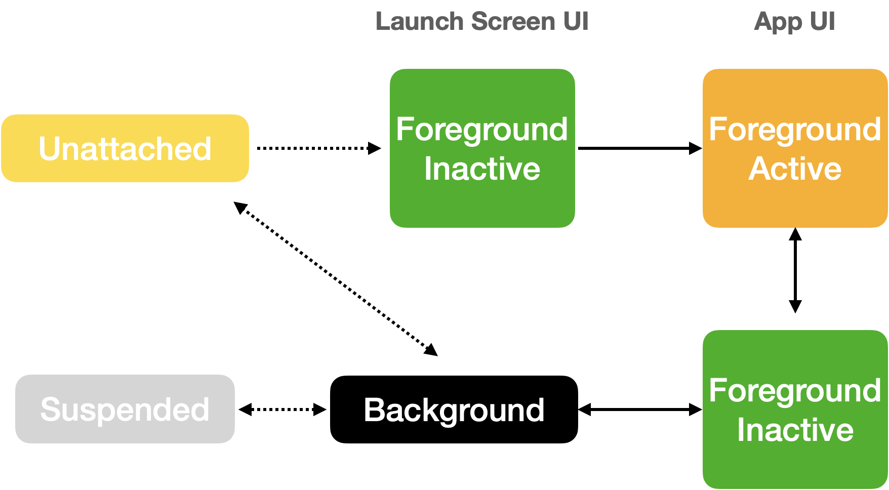

# iOS App's Life Cycle

## App State
- Not Running
  - App이 아직 실행되지 않았거나, 완전히 종료되어 동작하지 않는 상태
- Inactive
  - App이 실행중이지만 사용자로부터 Event를 받을 수 없는 상태
  - App이 실행중이지만 전화, 알림 등에 의해 App을 사용할 수 없는 상태로 진입
- Active
  - App이 실제로 실행중인 상태, 사용자 event를 받아 상호작용할 수 있는 상태
  - Active & Inactive를 합쳐 Foreground라 함, Foreground -> Background 상태로 이동시 반드시 Inactive를 거침
- Background
  - 홈 화면으로 나가거나 다른 앱으로 전환되어 현재 앱이 실질적으로 동작을 하지 않는 상태
- Suspended
  - App을 다시 실행했을 때 최근 작업을 빠르게 Load하기 위해 메모리에 관련 데이터만 저장되어 있는 상태
  - App이 Background 상태로 진입했을 때 다른 작업을 하지 않으면 Suspended 상태로 진입 (보통 2~3초 이내로 전환)
  - Suspended 상태의 앱들은 iOS가 메모리가 부족해지는 상황이 오면 가장 먼저 메모리에서 해제 됨

## Managing App's Life Cycle
- iOS 12 이전
  - 전체 Life Cycle을 UIApplicationDelegate에서 관리
    - ==> 해당 protocol을 채택하고 있는 AppDelegate에서 대응하는 함수를 구현
- iOS 13 이후
  - Scene 개념이 도입, 하나의 App이 여러 UI LifeCycle을 가질 수 있게 됨. 각각의 Scene에서 관리하는 UI Life Cycle은 **UISceneDelegate**에서 관리, 해당 Protocol을 채택하고 있는 SceneDelegate가 각각의 Scene에서 관리하는 UI Life Cycle에 대응되는 함수들을 구현함
  - App 실행 및 종료와 관련된 **Process Life Cycle**은 **AppDelegate**에서, App이 Foreground와 Background 상태에 있을 때 상태 전환과 관련된 UI Life Cycle은 **SceneDelegate**에서 관리

### Respond to App-Based Life Cycle(iOS 12이전, Scene 사용 X)

- App 실행: Not Running - Inactive - Active
  - **application(_: didFinishLaunchingWithOptions:)**
    - App이 실행되고 App을 화면에 띄우기 위한 모든 설정이 완료된 후 씰제로 화면에 나타나기 직전에 호출
    - UIWindow 생성등의 일을 여기서 함
  - **applicationDidBecomeActive(_:)**
    - App이 Inactive에서 Active시 호출
- Background (off screen): Active - Inactive - Background( - Suspended)
  - **applicationWillResignActive(_:)**
  - **applicationDidEnterBackground(_:)**
- Foreground (on screen): Background - Inactive - Active
  - **applicationWillEnterForeground(_:)**
    - Background -> Inactive
  - **applicationDidBecomeActive(_:)**
- App 종료: Background or Suspended - Not Running
  - **applicationWillTerminate(_:)**
    - App이 사용자에 의해 종료시만 호출, System Error로 종료시엔 호출되지 않음

### Response to Sccene-Based Life Cycle(iOS 13이후, Scene 사용)

- App 실행
  - **application(_: didFinishLaunchingWithOptions)**
- Scene 연결
  - App이 실행되면 UIK에 Scene을 연결해야함
  - **application(_: configurationForConnecting: options:)**
    - 새로운 Scene을 만들고 UIKit과 연결하기 위한 Configuration을 지정(Scene의 delegation 객체를 지정하는 등 Scene을 연결하기 위한 정보가 들어있는 UISceneConfiguration 객체를 말함, 보통 info.plist에 추가된 기본값을 사용)
    - 

  - **scene(_: willConnectTo: options:)**
    - Scene이 연결될 것임을 delegate에 알려줌
    - UIWindow 생성등을 여기서 함
  - **sceneDidBecomeActive(_:)**
    - Inactive -> Active
- Background(off screen): Active - Inactive - Background( - Suspended)
  - **sceneWillResignActive(_:)**
    - Active -> Inactive
  - **sceneDidEnterBackground(_:)**
    - Inactive -> Background
- Foreground(on screen): Background - Inactive - Active
  - **sceneWillEnterForeground(_:)**
    - Background -> Inactive
  - **sceneDidBecomeActive**
    - Inactive -> Active
- Scene 연결해제
  - Scene 사용씨 MultiWindow를 지원해 App이 둘 이상의 Scene Window를 가지면 Swipe up 제스처로 App을 종료하는것이 아닌 Scene을 해제하는것이 됨, 모든 Scene의 연결이 해제되었다면 App이 종료됨
  - **sceneDidDisconnected(-:)**
    - delegate에서 UIKit에 연결된 Scene의 연결을 해제할 것을 요청
  - **application(_: didDiscardSceneSessions:)**
    - Multitasking 화면에서 한개 이상의 Scene을 종료시 호출
  - **applicationWillTerminate(_:)**
    - App이 사용자에의해 종료시 호출, System Error일 경우 호출하지 않음